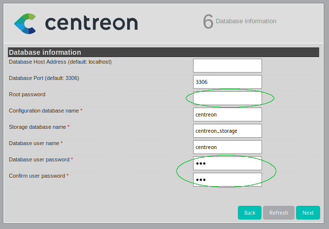

# Sommaire
1. [Prérequis](#Prérequis)
1. [Installation de Centreon CES (ISO)](#Installation de Centreon CES (ISO))
1. [Première connexion](#Première connexion)
1. [Démarrage du poller](#Démarrage du poller)
1. [Ajout d'un hôte windows](#Ajout d'un hôte windows)
    * [Redémarrage du poller après modification de la configuration](#Redémarrage du poller après modification de la configuration)
1. [Débogage : host unreachable](#Débogage : host unreachable)
1. [Les templates](#Les templates)
    1. [Modification d'un template existant](#Modification d'un template existant)
    1. [Ajouter l'uptime au template OS-Windows-SNMP-custom](#Ajouter l'uptime au template OS-Windows-SNMP-custom)
1. [Les centreon-plugins (gitlab)](#Les centreon-plugins (gitlab))
    1. [Mise en place](#Mise en place)
    1. [Construire une commande](#Construire une commande)
    1. [Implémentation de la commande dans Centreon (UI)](#Implémentation de la commande dans Centreon (UI))
        1. [Création de la commande](#Création de la commande)
        1. [Création du service](#Création du service)
        1. [Création du template](#Création du template)
1. [Débogage : UNKNOWN: SNMP GET Request : Timeout](#Débogage : UNKNOWN: SNMP GET Request : Timeout)
1. [Configuration avancée](#Configuration avancée)


<a name="Prérequis"></a>
# Prérequis

|Nombre de services | Nombre d’hôtes estimé | Nombre de collecteurs | Central        |
|:-----------------:|:---------------------:|:---------------------:|:--------------:|
| < 500             | 50                    | 1 central             | 1 vCPU / 1 GB  |

Accès Internet depuis la machine Centreon.
Un e-mail pour avoir 5 templates (ensemble de sondes) supplémentaires.

Pour plus de détail, voir :
[Prérequis centreon](https://documentation-fr.centreon.com/docs/centreon/en/2.8.x/installation/prerequisites.html)

<a name="Installation de Centreon CES (ISO)"></a>
# Installation de Centreon CES (ISO)

Une fois l'ISO de Centreon CES monté, l'installation est quasiement identique à l'installation de CentOS 7. La seule option qu'il est nécessaire de renseigner, en plus de la destination, est le type d'installation.


Cliquer sur « installation type » et en standalone c'est une installation de type « Central with database » qu'il faut sélectionner.


Une fois l'installation terminée, il faut redémarrer la machine, avoir une session bash ensuite s'y connecter et régler les paramètres réseaux via, par exemple l'utilitaire `nmtui`. Une fois la machine connecter au réseau, lancer un `yum update -y`, ensuite installer git (`yum install git -y`) et faire un dernier redémarrage.

Une fois la mise à jour terminée, il faut finir l'installation via un navigateur web à l'adresse du serveur (http:<ip-du-serveur>/>. La fin de l'installation est très intuitif, il y a 8 étape qui sont numérotées en haut à droite.


À l'étape 2 Centreon vérifie que tous les modules sont bien chargés. À l'étape 3 et 4 Centreon demande à confirmer les chemins des binaires, des fichiers de configuration et des fichier de logs.

À l'étape 5 ce sont les informations de login et du premier utilisateur qui doivent être renseignées.

_Note_ : il faut bien comprendre ici que le login c'est **admin** et non « John » (dans l'exemple). C'est, donc bien **admin** qu'il faudra renseigner à la page de connexion.


À l'étape 6, les informations de connexion à la base de données sont demandées. Dans ce cas, l'accès à la base de données en root se fait sans mot de passe. Cependant, à la fin de l'installation, il est tout à fait possible de lancer un `mysql_secure_installation` afin, entre autre, de mettre un mot de passe à la base de données.



À l'étape 7 Centreon applique les paramètres précédement renseignés, la derière ligne de cette étape peut prendre plusieurs minutes.

Étape 8, installation terminée.

<a name="Première connexion"></a>
# Première connexion

Le login étant **admin** et le mot de passe, celui renseigné à l'étape 5 de l'installation.


L'une des première chose à faire une fois connecté à l'interface d'administration, c'est d'aller dans « Administration / Extensions » et d'activer **centreon-license-manager** et **centreon-pp-manager** en cliquant sur la roue dentée dans la colone « Actions ».


Ce qui nous amène à cette page :


où il faut cliquer sur **Install Module** (à faire pour les 2 extensions).

_Note_ : il est possible que Centreon propose une mise à jour de ces extensions, dans ce cas une flèche verte apparaît près de l'extension en question comme illustré.

_facultatif_ : Un fois ces extensions activées, sur la même page à gauche apparaît le nouvel item « Subscription ». Il faut aller dans ce menu pour commencer le processus d'ajout des plugins gratuit.


_facultatif_ : En cliquant sur « Subscribe now » on arrive sur le « store » de Centreon. Cliquer sur « ESSAYER » dans le block « Offre d'essai ». Remplir le formulaire du block « Nouveau client ? ». Une fois cette étape terminée (il est possible que la confirmation de création de compte ne soit pas instantannée). Une fois cela terminé 5 plugins supplémentaire sont disponible, ils permettent de superviser :
* DHCP,
* DNS,
* FTP,
* HTTP,
* LDAP

L'administration des plugins se fait via « Configuration / Plugin Packs ». Pour activer un plugin, il faut le survoler et cliquer sur le plus. Les plugins activés sont visible grâce au carré vert en haut à droite de chaque plugin.


<a name="Démarrage du poller"></a>
# Démarrage du poller

À ce stade Centreon n'est toujours pas utilisable, il faut démarrer le **poller central**. Pour ce faire, aller dans « Configuration / Pollers ». Sur cette page on voit que le poller ne tourne pas (Is runing : NO). Cocher la case **Central** et cliquer sur **Export configuration**. 

 

S'assurer que **Central** est bien présent dans le block « Polling instances », cocher les 4 premières cases du block « Actions », sélectionner **Restart**  dans « Method ». Enfin cliquer sur « Export ».  

 

Après quelques minutes, le poller devrait tourner (Is runing : YES).


Centreon est maintenant fonctionnel.

Étape suivante : ajouter les hôtes.

<a name="Ajout d'un hôte windows"></a>
# Ajout d'un hôte windows

Aller dans « Configuration / Hosts », cliquer sur « Add ».


Sur cette page il faut renseigner les champs entourés de l'illustration suivante où il faut renseigner :
* Le nom de la machine à superviser,
* Son alias,
* Son IP / nom de domaine,
* La communauté SNMP,
* La version de SNMP utilisé,
* Le template à utiliser pour cet hôte

Sauvegarder en cliquant sur « Save » 
À ce stade l'hôte est bien enregistré dans la BDD, cependant il reste une étape pour que cette nouvelle configuration soit prise en compte : le rechargement du poller.


<a name="Redémarrage du poller après modification de la configuration"></a>
## Redémarrage du poller après modification de la configuration

De la même façon que pour le démarrage de ce poller, aller dans « Configuration / Pollers ». Sur l'illustration on voit que la configuration a changé (Conf Changed : YES). Cela veut dire qu'un ou plusieurs hôtes on été ajoutés.
Cocher la case **Central** et cliquer sur **Export configuration**.


S'assurer que **Central** est bien présent dans le block « Polling instances », cocher les 4 premières cases du block « Actions », sélectionner **Restart**  dans « Method » (si beaucoup de modification sont faites il est préférable de faire un **Reload** en premier lieu). Enfin cliquer sur « Export ».


L'illustration suivante indique que tout c'est bien passé.


Pour voir l'avancement des remontés d'information, aller dans « Monitoring / Status Details ». Dans « Service Status » sélectionner **All**.
Dans ce cas, aucune information n'est remontées pour le moment.


Après quelques minutes, on peut voir que la plupart des informations commencent à remonter.


<a name="Débogage : host unreachable"></a>
## Débogage : host unreachable

Une erreur courante à ce stade c'est de mal configurer SNMP côté client ou de mal renseigner le nom de la communauté SNMP côté Centreon.
Sur l'illustration, on voit que le ping fonctionnent correctement, indiquant que l'hôte est bien accessible mais rien ne remonte via SNMP.


Pour corriger le problème, se connecter à Centreon en SSH et faire un `snmpwalk` sur la machine que l'on souhaite joindre via SNMP.

```bash
# snmpwalk -v 2c -c public 192.168.0.61
```

Résultat possible en cas d'erreur

```
Timeout: No Response from 192.168.0.61
```

Vérifier que l'agent SNMP est bien en service sur le client, que le pare-feu laisse bien passer SNMP et ou que la redirection de port (NAT) est correcte.

Un `snmpwalk` qui abouti proprement ressemble à ceci :


<a name="Les templates"></a>
# Les templates

Un template (modèle) est une pré-configuration de paramètres d’un objet qui pourra être utilisé pour configurer ce dernier. Le principal avantage des templates est de pouvoir définir des valeurs par défaut pour certains objets afin d’accélérer la création d’objets similaires.

<a name="Modification d'un template existant"></a>
## Modification d'un template existant

Il peut-être nécessaire de modifier un template de façon à ajouter des sondes que l'on juge utile.

Aller dans « Configuration / Hosts / Templates » et sélectionner le template à modifier, ici **OS-Windows-SNMP-custom**.

<a name="Ajouter l'uptime au template OS-Windows-SNMP-custom"></a>
## Ajouter l'uptime au template OS-Windows-SNMP-custom

Une fois dans le template **OS-Windows-SNMP-custom**, pour ajouter _Uptime_ aux machines Windows aller dans l'onglet « relation » et sélectionner _OS-Windows-Upitme-SNMP-custom_. Enfin sauvegarder (en cliquant sur « Save »).

À présent il faut modifier l'hôte où les hôtes utilisant ce template.
Aller dans « Configuration / Hosts », dans le champ « Template » sélectionner  **OS-Windows-SNMP-custom** et cliquer sur « Search ». Tous les hôtes utilisant ce template seront listés.


Sélectionner les hôtes à modifier, cliquer sur « Yes » du bouton radio **Create Services linked to the Template too** et sauvegarder. Enfin pour appliquer ces nouveaux changement, il faut redémarrer (ou recharger selon le cas) le poller [comme décrit précédement](#Redémarrage du poller après modification de la configuration).

Aller dans « Monitoring / Status Details » pour voir l'évolution de la requête. La sonde _Uptime_ à bien été ajoutée et prise en compte.


Après quelques minutes, on à la valeur de _Uptime_.


<a name="Les centreon-plugins (gitlab)"></a>
# Les centreon-plugins (gitlab)

“centreon-plugins” est un projet gratuit et open source pour surveiller les systèmes. Le projet peut être utilisé avec Centreon et tous les logiciels de surveillance compatibles avec les plugins Nagios.

<a name="Mise en place"></a>
## Mise en place

Afin d'avoir plus de plugins, notement pour les _NAS Synology_, il faut cloner le dépot des plugins Centreon sur Gitlab dans `/usr/lib/centreon/plugins`

```bash
cd /usr/lib/centreon/plugins
git clone https://github.com/centreon/centreon-plugins.git
```

Ensuite changer les droits d'exécution du fichier de façon à éviter d'alourdir la commande en ajoutant « perl » au début de la commande dans l'UI Centreon :

```bash
chmod 775 /usr/lib/centreon/plugins/centreon-plugins/centreon_plugins.pl
```

<a name="Construire une commande"></a>
## Construire une commande

Ce qui suit est très largement inspiré de [la documentation de ce projet](https://github.com/centreon/centreon-plugins) qui est très explicite, il faut simplement remplacer **linux** par le constructeur du produit que l'on souhaite superviser.

Par exemple, pour un NAS Synology :

```bash
perl centreon_plugins.pl --list-plugin | grep -i synology | grep 'PLUGIN'
```

Résultat attendu

```
PLUGIN: storage::synology::snmp::plugin
```

On a donc bien un plugin SNMP de type stockage pour du Synology. L'étape suivante est de voir les **mode** proposé pour ce plugin via l'option `--list-mode`.

```bash
perl centreon_plugins.pl --plugin=os::linux::snmp::plugin --list-mode
```

Résultat attendu
``` 
[…]
Modes Available:
    cpu
    cpu-detailed
    disk-usage
    diskio
    inodes
    interfaces
    list-diskspath
    list-interfaces
    list-storages
    load
    memory
    processcount
    storage
    swap
    tcpcon
    time
    uptime
```

Pour avoir de l'aide sur un **mode**, voici la commande (pour le CPU par exemple).

```bash
perl centreon_plugins.pl --plugin=os::linux::snmp::plugin --mode=cpu --help
```

Résultat attendu
```
 --warning
	Threshold warning in percent.
 --critical
	Threshold critical in percent.
```

On a toutes les informations nécessaires, la commande peut être construite.

```bash
 perl centreon_plugins.pl --plugin=storage::synology::snmp::plugin --mode=cpu --hostname=192.168.0.20 --snmp-version='2c' --snmp-community='vision_ccpc'  --warning='80'
```

Résultat attendu
```
OK: 2 CPU(s) average usage is: 0.50% | 'cpu0'=1.00%;;;0;100 'cpu1'=0.00%;;;0;100 'total_cpu_avg'=0.50%;0:80;;0;100
```

La commande doit retourner des informations sur le CPU.

<a name="Implémentation de la commande dans Centreon (UI)"></a>
## Implémentation de la commande dans Centreon (UI)

L'implémentation d'une commande se fait à 3 niveaux et dans 3 menus.

| Niveau | Menu |
|:--------|:----|
| création de la commande | Configuration / Commands |
| création du service | Configuration / Services / **Templates** |
| création du template | Configuration / Hosts / **Templates** |

<a name="Création de la commande"></a>
### Création de la commande

Aller dans « Configuration / Commands », cliquer sur « Add ».
_Note_ : dans un autre onglet, ouvrir une commande proche de celle que l'on va créer. Dans ce cas **OS-Linux-SNMP-Cpu**. Copier là et coller là dans la zone de texte appropriée. La structure est la même seul le nom du plugin change dans ce cas.


Renseigner le nom de la commande ainsi que la commande en elle-même. Voici la commande.

```
$CENTREONPLUGINS$/centreon-plugins/centreon_plugins.pl --plugin=storage::synology::snmp::plugin --mode=cpu --hostname=$HOSTADDRESS$ --snmp-version='$_HOSTSNMPVERSION$' --snmp-community='$_HOSTSNMPCOMMUNITY$'  --warning='$_SERVICEWARNING$' --critical='$_SERVICECRITICAL$' '$_SERVICEEXTRAOPTIONS$'
```

Cliquer sur « Describe macros », une pop-up s'affiche avec l'ensemble des variables qu'on est libre de renseigner ou non, cliquer sur « Save ».
_Note_ : aucune commande par défaut n'est renseignée, cependant cette étape semble nécessaire.

Ensuite sauvegarder.

Quelques explications :
| Variable | Fonction |
|:-|:-|
| $CENTREONPLUGINS$ | chemin du répertoire des plugins |
| $HOSTADDRESS$ | l'IP ou le nom de l'hote |
| $\_HOSTSNMPVERSION$ | la version de SNMP |
| $\_HOSTSNMPCOMMUNITY$ | la communauté SNMP |
| $\_SERVICEWARNING$ | valeur à laquelle le service doit passer en \_warning\_ |
| $\_SERVICECRITICAL$ | valeur à laquelle le service doit passer en \_critical\_ |
| $\_SERVICEEXTRAOPTIONS$ | option supplémentaire |

Les variables précédées de « $\_HOST* » sont accessible (et modifiable) le template d'hôte.
Les variables précédées de « $\_SERVICE* » sont accessible (et modifiable) dans le service qui lui est associé.


<a name="Création du service"></a>
### Création du service

Aller dans « Configuration / Services / Templates », cliquer sur « Add ».
Renseigner le nom et l'alias du service.
Dans « Check Command » chercher la commande **NAS-synology-check-Cpu**. Renseigner la valeur de « warning » et « critical ». Ce seront les valeurs pas défaut qu'il est possible de modifier après la création de l'hôte. Ces valeurs sont généralement fixées à 80 et 90.

Sauvegarder.


<a name="Création du template"></a>
### Création du template

Aller dans « Configuration / Hosts / Templates », cliquer sur « Add ».
Renseigner le nom et l'alias du template. Régler le fuseau horaire.
**Important** : ajouter le template **generic-active-host-custom**. Ce template permet d'inclure le service « ping » sans lequel l'hôte apparaîtra toujours en « pending » dans l'interface.


Ensuite aller dans l'onglet « Relations » et dans « Linked Service Templates » ajouter le service **NAS-synology-check-Cpu**.

Sauvegarder.


_Note_ : c'est dans cet onglet que plus tard on ajoute les autres services. Car un template regroupe généralement plusieurs services comme le montre l'illustration suivante.


Ce template est terminé.

<a name="Configuration avancée"></a>
# Configuration avancée

## Ajouter une icône

Les icônes permettent d'identifier simplement un hôte ou un groupe d'hôte. Comme, par exemple, les templates **OS-Windows-SNMP-custom** et **OS-Linux-SNMP-custom**.
Pour ajouter une icône, aller dans « Administration / Parameters / Images » et cliquer sur « Add ».


<a name="Débogage : UNKNOWN: SNMP GET Request : Timeout"></a>
# Débogage : UNKNOWN: SNMP GET Request : Timeout

Il arrive qu'un service parfaitement joignable lors de l'ajout de l'hôte devient inaccessible, avec comme message :

```
UNKNOWN: SNMP GET Request : Timeout
```

Comme on le voit sur l'illustration, certains services fonctionnent partaitement, d'autres sont en Timout (Memory et Swap ici).


Ceci est dû au fait que Centreon n'attend pas assez longtemps avant d'obtenir la réponse. Pour corriger ce comportement il faut modifier le _timeout_ de ces services.

Aller dans « Configuration / Services » chercher le service faisant défaut et l'éditer. Dans le champ **EXTRAOPTIONS** ajouter :

```
--snmp-timeout=10
```


Enregistrer et [recharger la configuration](#Redémarrage du poller après modification de la configuration).


